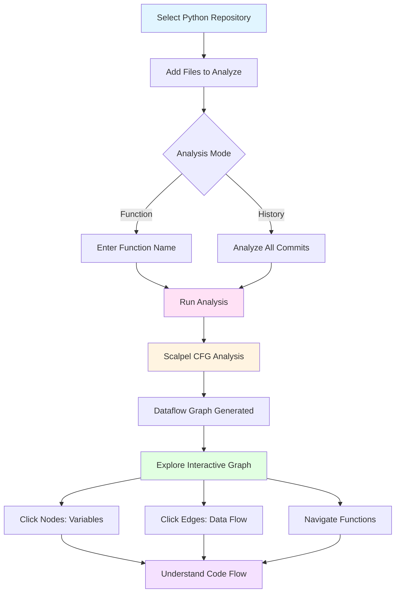

# DFGviz - DataFlow Graph Visualizer

<div align="center">


**Professional Python Dataflow Analysis Tool with Interactive Visualizations**


*DFGviz - DataFlow Graph Visualizer in action*

[](LICENSE)
[](https://www.python.org/)
[]()

[Features](#features) • [Installation](#installation) • [Usage](#usage) • [Screenshots](#screenshots) • [Demo](#demo) • [Documentation](#documentation)

</div>

---

## 🎯 Overview

DFGviz (DataFlow Graph Visualizer) is a powerful, user-friendly tool for analyzing Python code dataflow across git history. It provides interactive visualizations, function-level analysis, and comprehensive dataflow tracking using Scalpel CFG (Control Flow Graph) analysis.

> **🆕 C++ Support Available!** Full C++ analysis with CMake integration using Clang/LLVM. See [C++ & CMake Support](#-c--cmake-support) section below.

### Key Highlights

- ✅ **Interactive GUI** - No command-line knowledge required
- ✅ **Git History Analysis** - Track dataflow changes across commits
- ✅ **Function-Level Analysis** - Analyze specific functions or entire codebase
- ✅ **Interactive Visualizations** - Beautiful D3.js-based dataflow graphs
- ✅ **Standalone Binary** - No installation needed, works out of the box
- ✅ **Multi-File Support** - Analyze multiple Python files simultaneously
- ✅ **C++ Support** - Full C++ analysis with Clang/LLVM and CMake integration
- ✅ **CMake Integration** - Automatic CMakeLists.txt parsing for accurate compilation context

---

## ✨ Features

### 🔍 **Comprehensive Dataflow Analysis**
- Variable-to-variable dataflow tracking
- Path-sensitive analysis using Scalpel CFG
- Interprocedural analysis across function boundaries
- Control flow tracking with path conditions

### 📊 **Interactive Visualizations**
- **D3.js-based graphs** - Interactive, zoomable, and draggable
- **Node size coding** - Visual representation of flow complexity
- **Color-coded edges** - Normal flows, path conditions, and bidirectional flows
- **Function call graphs** - Visualize function relationships
- **Diff visualization** - Compare dataflow across commits

### 🎨 **User-Friendly GUI**
- **Progress tracking** - Real-time progress bar and colored log output
- **File management** - Easy file selection with multi-file support
- **Function detection** - Auto-detect available functions in your code
- **Repository browser** - Simple git repository selection
- **Export capabilities** - Export results to JSON format

### 🔄 **Git Integration**
- **Commit-by-commit analysis** - Analyze dataflow evolution over time
- **Safe operations** - Read-only git operations, never modifies your repository
- **Temporary file handling** - Analyzes commit versions without affecting working directory
- **Pre-generated function pages** - Fast navigation between function analyses

---

## 📸 Screenshots

<div align="center">

### Main GUI Interface


**DFGviz - Professional DataFlow Graph Visualizer**

</div>

---

## 🎥 Demo Video

<div align="center">

[](docs/demo_video.mp4)

**Watch the full demo:** [Download Demo Video](docs/demo_video.mp4) (or view in browser)

</div>

---

## 🚀 Installation

### Option 1: Download Pre-built Binary (Recommended)

1. Go to the [Releases](https://github.com/SuzaneANO/DFGviz/releases) page
2. Download the latest release for your platform:
   - **Windows**: `DFGviz-windows.zip`
   - **Linux**: `DFGviz-linux.tar.gz`
   - **macOS**: `DFGviz-macos.tar.gz`
3. Extract the archive
4. Run `DFGviz.exe` (Windows) or `DFGviz` (Linux/macOS)

**No installation required!** The binary includes all dependencies.

---

## 📖 Usage

### 🔄 Analysis Workflow



**How DFGviz Helps Analyze Python Code:**
- 🔍 **Track Variable Dataflow** - See how data flows between variables
- 🔗 **Follow Function Calls** - Navigate function relationships visually
- 📊 **Path-Sensitive Analysis** - Understand dataflow through all code paths
- 📈 **Git History Tracking** - See how dataflow evolved across commits
- 🎯 **Interprocedural Analysis** - Complete picture across function boundaries

For detailed analysis workflow, see [WORKFLOW.md](WORKFLOW.md)

### Quick Start

1. **Launch the application**
   - Double-click `DFGviz.exe` (Windows)
   - Or run `./DFGviz` (Linux/macOS)

2. **Select a Git Repository**
   - Click "Browse" next to the Repository field
   - Navigate to your Python project's git repository

3. **Add Files to Analyze**
   - Click "Add Files" to select multiple Python files
   - Or click "Auto-detect" to find all Python files in the repository

4. **Choose Analysis Mode**
   - **Function Analysis**: Enter a function name (optional) and click "Detect Functions" to browse available functions
   - **Git History Analysis**: Leave function field empty to analyze all commits

5. **Run Analysis**
   - Click "Analyze" button
   - Watch the progress bar and colored log output

6. **View Results**
   - Check the "Results" tab for analysis summary
   - Click "Generate HTML Graphs" to create interactive visualizations
   - Click "Serve HTML Files" to view graphs in your browser

### Function-Level Analysis

To analyze a specific function:

1. Select files containing the function
2. Click "Detect Functions" to see available functions
3. Select a function from the popup or type it manually
4. Click "Analyze"
5. The analysis will focus only on the selected function

### Git History Analysis

To analyze dataflow across git commits:

1. Select files to analyze
2. Leave the function field empty
3. Click "Analyze"
4. The tool will analyze each commit in your git history
5. View results in the "Commits" tab

---

## 🔧 C++ & CMake Support

DFGviz now includes comprehensive C++ analysis capabilities with CMake integration for accurate, path-sensitive analysis.

### 🎯 C++ Analysis Features

- **Clang/LLVM Integration** - Uses Clang's AST for precise C++ parsing
- **CMakeLists.txt Parsing** - Automatically extracts compilation settings
- **Path-Sensitive Analysis** - Understands `#ifdef` blocks based on actual CMake defines
- **Header File Support** - Properly resolves and analyzes `.h` and `.hpp` files
- **Class & OOP Analysis** - Tracks class methods, attributes, and inheritance
- **Interprocedural Analysis** - Follows dataflow across function boundaries
- **Multi-file Analysis** - Analyzes entire C++ projects with correct context

### 📋 C++ Requirements

#### System Requirements
- **Clang/LLVM** must be installed:
  - **Windows**: `choco install llvm` or download from [LLVM releases](https://github.com/llvm/llvm-project/releases)
  - **Linux**: `sudo apt-get install clang libclang-dev` (Ubuntu/Debian)
  - **macOS**: `brew install llvm` or comes with Xcode

#### Python Dependencies
```bash
pip install clang>=16.0.0
```

#### Environment Setup
Set `LIBCLANG_PATH` if needed:
- **Windows**: `set LIBCLANG_PATH=C:\Program Files\LLVM\bin\libclang.dll`
- **Linux**: `export LIBCLANG_PATH=/usr/lib/x86_64-linux-gnu/libclang.so.1`
- **macOS**: `export LIBCLANG_PATH=/usr/local/opt/llvm/lib/libclang.dylib`

### 🏗️ CMake Integration

DFGviz can parse `CMakeLists.txt` to extract exact compilation settings:

#### What CMake Integration Provides

1. **Include Path Resolution**
   - Extracts `include_directories()` → `-I` flags for Clang
   - Resolves `${CMAKE_SOURCE_DIR}` and other CMake variables
   - Ensures headers are found correctly

2. **Preprocessor Definitions**
   - Extracts `add_definitions(-DDEBUG_MODE)` → `-DDEBUG_MODE` flag
   - Enables accurate path-sensitive analysis of `#ifdef` blocks
   - Understands conditional compilation based on actual CMake defines

3. **C++ Standard Version**
   - Reads `set(CMAKE_CXX_STANDARD 17)` → `-std=c++17` flag
   - Ensures Clang uses the correct C++ standard

4. **Source/Header Discovery**
   - Parses `set(SOURCES ...)` and `set(HEADERS ...)` lists
   - Enables multi-file project analysis

#### Example: CMakeLists.txt

```cmake
cmake_minimum_required(VERSION 3.10)
project(MyProject)

set(CMAKE_CXX_STANDARD 17)
set(CMAKE_CXX_STANDARD_REQUIRED ON)

# Include directories
include_directories(${CMAKE_SOURCE_DIR}/include)
include_directories(${CMAKE_SOURCE_DIR}/src)

# Compile definitions
add_definitions(-DDEBUG_MODE)
add_definitions(-DVERSION_MAJOR=1)

# Source files
set(SOURCES
    src/main.cpp
    src/calculator.cpp
)

add_executable(my_app ${SOURCES})
```

#### Using CMake Integration

**In GUI:**
1. Select **C++** as the language
2. Select a repository with `CMakeLists.txt`
3. Add C++ files to analyze (or use Auto-detect)
4. DFGviz will automatically parse CMakeLists.txt and use correct settings

**Programmatically:**
```python
from cmake_parser import CMakeParser
from clang_complete_dataflow import ClangDataflowAnalyzer

# Parse CMakeLists.txt
parser = CMakeParser(Path("CMakeLists.txt"))

# Get compile arguments for a source file
source_file = Path("src/main.cpp")
compile_args = parser.get_compile_args(source_file)

# Analyze with CMake context
analyzer = ClangDataflowAnalyzer(str(source_file), compile_args=compile_args)
analyzer.analyze_with_clang()
```

### 🧪 Testing C++ Analysis

Run the comprehensive C++ test suite:

```bash
# Run all C++ tests
python test_cpp_runner.py --all

# Run CMake-specific tests
python test_cmake_analysis.py
```

### 📚 C++ Documentation

- [C++ Analysis Guide](CPP_ANALYSIS_README.md) - Detailed C++ analysis documentation
- [CMake Integration Guide](CMAKE_INTEGRATION_GUIDE.md) - CMake parsing and usage
- [CMake Analysis README](CMake_ANALYSIS_README.md) - CMake parser documentation
- [Test Documentation](TEST_README.md) - Testing guide for C++ analysis

### 🎯 Path-Sensitive Analysis Example

With CMake integration, DFGviz understands conditional compilation:

```cpp
int main() {
    int x = 10;
    
    #ifdef DEBUG_MODE  // From CMake: add_definitions(-DDEBUG_MODE)
        int debug_value = x * 2;  // Only analyzed if DEBUG_MODE defined
        x = debug_value;
    #endif
    
    return x;
}
```

**Without CMake**: Might miss `debug_value` if `DEBUG_MODE` isn't defined.

**With CMake**: 
- Parses `add_definitions(-DDEBUG_MODE)` from CMakeLists.txt
- Analyzes with `DEBUG_MODE` defined
- Detects `debug_value` and tracks dataflow: `x → debug_value → x`

---

## 🎨 Features in Detail

### Interactive Dataflow Graph

The generated HTML graphs provide:

- **Zoom & Pan** - Scroll to zoom, drag to pan
- **Node Interaction** - Click nodes to see variable details
- **Edge Information** - Hover over edges to see dataflow information
- **Filtering** - Filter by flow type, path conditions, or class attributes
- **Export** - Export graphs as SVG files

### Progress Tracking

- **Real-time Progress Bar** - Shows current/total commits being analyzed
- **Colored Log Output**:
  - 🔵 Blue - Information messages
  - 🟢 Green - Success messages
  - 🟠 Orange - Warning messages
  - 🔴 Red - Error messages

### Export & Sharing

- Export analysis results to JSON
- Generate standalone HTML files
- Share HTML files with team members (no server needed)

---

## 📚 Documentation

- [User Guide](docs/USER_GUIDE.md) - Detailed usage instructions
- [API Reference](docs/API.md) - Programmatic API documentation
- [Troubleshooting](docs/TROUBLESHOOTING.md) - Common issues and solutions

---

## 🔧 Technical Details

### Built With

- **Python 3.8+** - Core language
- **Scalpel** - CFG-based dataflow analysis
- **Tkinter** - GUI framework
- **D3.js** - Interactive visualizations
- **PyInstaller** - Binary packaging

### Architecture

- **Frontend**: Tkinter GUI with progress tracking
- **Backend**: Scalpel CFG analysis engine
- **Visualization**: D3.js-based interactive graphs
- **Git Integration**: Read-only git operations

### Scalpel Usage & Coverage

DFGviz uses Scalpel efficiently, focusing on its core CFG building capabilities. Coverage analysis shows that DFGviz uses approximately **4% of Scalpel's codebase**, which is optimal for our use case.

| Module Category | Coverage | Status | Usage |
|----------------|----------|--------|-------|
| **CFG Building** | 19% | ✅ Used | Core functionality for building control flow graphs |
| **MNode Core** | 15% | ✅ Used | Function definitions, variables, function calls parsing |
| **Visitors** | 19% | ✅ Used | Function call and variable tracking |
| **SSA** | 0% | ❌ Unused | Static Single Assignment analysis (not needed) |
| **Call Graph (pycg)** | 0% | ❌ Unused | Program-wide call graph (custom implementation) |
| **Type Inference** | 0% | ❌ Unused | Type analysis (not needed) |
| **Overall** | **~4%** | ✅ **Optimal** | Efficient usage of Scalpel's CFG foundation |

**Key Findings:**
- ✅ DFGviz uses Scalpel's CFG building and basic parsing features
- ✅ Only necessary modules are loaded, ensuring optimal performance
- ✅ Custom dataflow analysis built on top of Scalpel's CFG foundation
- ✅ Unused features (SSA, type inference, call graph) are not needed for our use case

📊 **Detailed Coverage Report**: See [SCALPEL_COVERAGE_REPORT.md](SCALPEL_COVERAGE_REPORT.md) for complete analysis.

---

## 📋 Requirements

### System Requirements
- **Windows**: Windows 10 or later
- **Linux**: Most modern distributions  
- **macOS**: macOS 10.14 or later
- **Git**: Required for git history analysis (included in most systems)

### For Binary (No Requirements)
The pre-built binary includes everything - just download and run!

### Python Dependencies

**For Python Analysis:**
```
python-scalpel>=0.1.0
pyinstaller>=5.0.0
```

**For C++ Analysis (Optional):**
```
clang>=16.0.0
```

**Full Requirements:**
See [requirements.txt](requirements.txt) for complete list.

---

---

## 📝 License

This project is licensed under the MIT License - see the [LICENSE](LICENSE) file for details.

---

## 🙏 Acknowledgments

- [Scalpel](https://github.com/SMAT-Lab/Scalpel) - For the excellent CFG analysis framework
- [D3.js](https://d3js.org/) - For powerful data visualization
- [PyInstaller](https://www.pyinstaller.org/) - For binary packaging

---

## 📞 Support

- **Issues**: [GitHub Issues](https://github.com/SuzaneANO/DFGviz/issues)
- **Discussions**: [GitHub Discussions](https://github.com/SuzaneANO/DFGviz/discussions)
- **Email**: adamsbane02@gmail.com

---

## 🗺️ Roadmap

- [ ] Cloud-based analysis for large repositories
- [ ] Integration with popular IDEs
- [ ] Real-time collaboration features
- [ ] Advanced filtering and search capabilities
- [ ] Export to various formats (PDF, PNG, etc.)

---

<div align="center">

**Made with ❤️ for Python developers**

[⭐ Star us on GitHub](https://github.com/SuzaneANO/DFGviz) • [📖 Documentation](docs/) • [🐛 Report Bug](https://github.com/SuzaneANO/DFGviz/issues)

</div>
