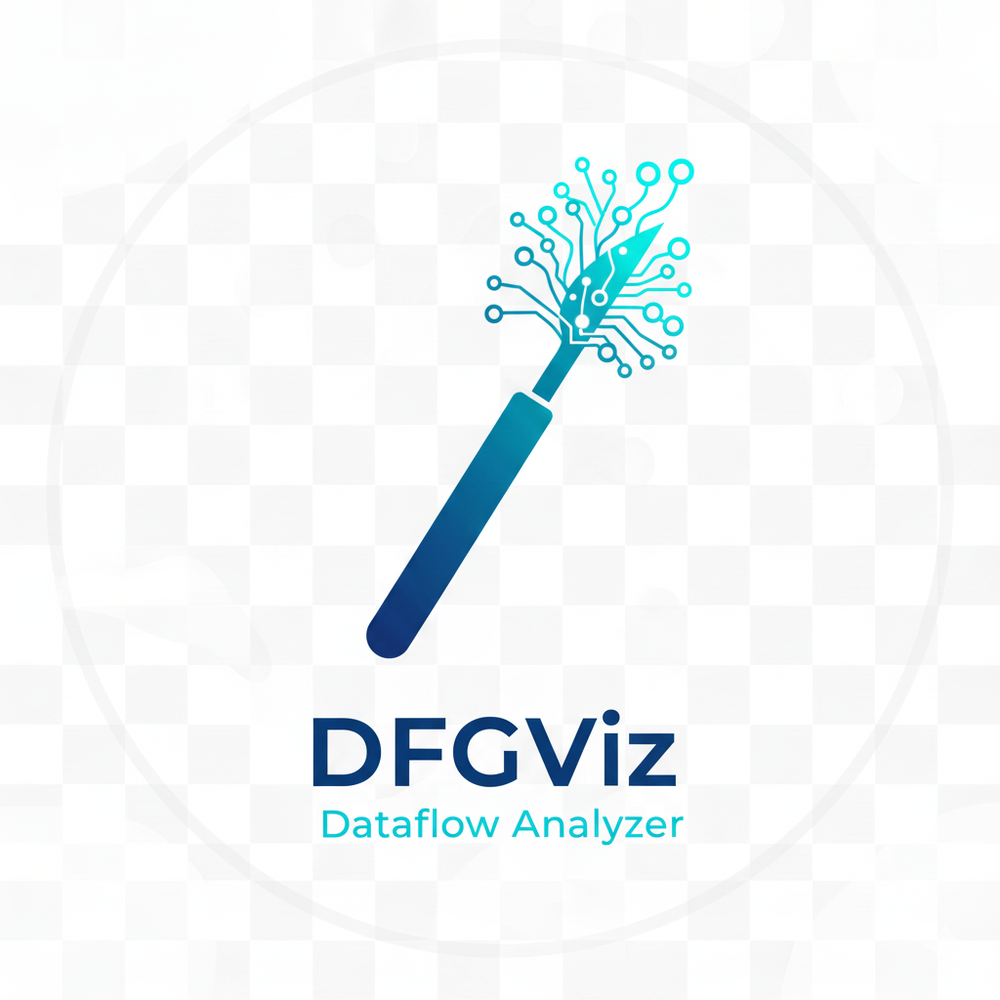
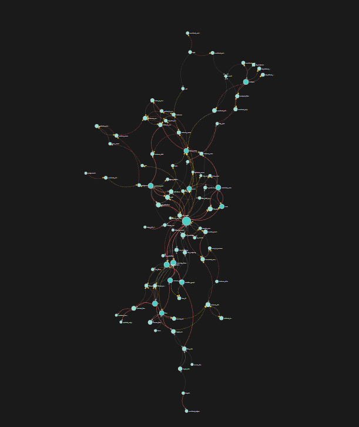
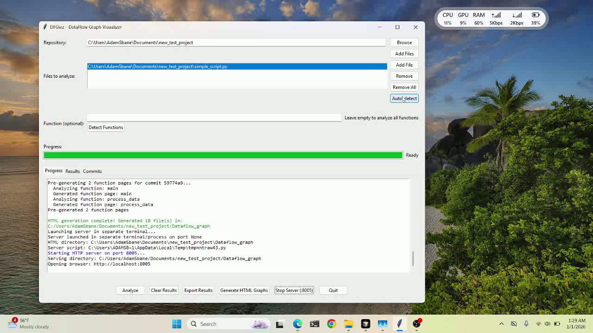

# DFGviz - DataFlow Graph Visualizer

<div align="center">



**Professional Python Dataflow Analysis Tool with Interactive Visualizations**



*DFGviz - DataFlow Graph Visualizer in action*

[](LICENSE)
[](https://www.python.org/)
[]()

[Features](#features) • [Installation](#installation) • [Usage](#usage) • [Screenshots](#screenshots) • [Demo](#demo) • [Documentation](#documentation)

</div>

---

## 🎯 Overview

DFGviz (DataFlow Graph Visualizer) is a powerful, user-friendly tool for analyzing Python code dataflow across git history. It provides interactive visualizations, function-level analysis, and comprehensive dataflow tracking using Scalpel CFG (Control Flow Graph) analysis.

### Key Highlights

- ✅ **Interactive GUI** - No command-line knowledge required
- ✅ **Git History Analysis** - Track dataflow changes across commits
- ✅ **Function-Level Analysis** - Analyze specific functions or entire codebase
- ✅ **Interactive Visualizations** - Beautiful D3.js-based dataflow graphs
- ✅ **Standalone Binary** - No installation needed, works out of the box
- ✅ **Multi-File Support** - Analyze multiple Python files simultaneously

---

## ✨ Features

### 🔍 **Comprehensive Dataflow Analysis**
- Variable-to-variable dataflow tracking
- Path-sensitive analysis using Scalpel CFG
- Interprocedural analysis across function boundaries
- Control flow tracking with path conditions

### 📊 **Interactive Visualizations**
- **D3.js-based graphs** - Interactive, zoomable, and draggable
- **Node size coding** - Visual representation of flow complexity
- **Color-coded edges** - Normal flows, path conditions, and bidirectional flows
- **Function call graphs** - Visualize function relationships
- **Diff visualization** - Compare dataflow across commits

### 🎨 **User-Friendly GUI**
- **Progress tracking** - Real-time progress bar and colored log output
- **File management** - Easy file selection with multi-file support
- **Function detection** - Auto-detect available functions in your code
- **Repository browser** - Simple git repository selection
- **Export capabilities** - Export results to JSON format

### 🔄 **Git Integration**
- **Commit-by-commit analysis** - Analyze dataflow evolution over time
- **Safe operations** - Read-only git operations, never modifies your repository
- **Temporary file handling** - Analyzes commit versions without affecting working directory
- **Pre-generated function pages** - Fast navigation between function analyses

---

## 📸 Screenshots

<div align="center">

### Main GUI Interface


**DFGviz - Professional DataFlow Graph Visualizer**

</div>

---

## 🎥 Demo Video

<div align="center">

[](docs/demo_video.mp4)

**Watch the full demo:** [Download Demo Video](docs/demo_video.mp4) (or view in browser)

</div>

---

## 🚀 Installation

### Option 1: Download Pre-built Binary (Recommended)

1. Go to the [Releases](https://github.com/SuzaneANO/DFGviz/releases) page
2. Download the latest release for your platform:
   - **Windows**: `DFGviz-windows.zip`
   - **Linux**: `DFGviz-linux.tar.gz`
   - **macOS**: `DFGviz-macos.tar.gz`
3. Extract the archive
4. Run `DFGviz.exe` (Windows) or `DFGviz` (Linux/macOS)

**No installation required!** The binary includes all dependencies.

### Option 2: Build from Source

#### Prerequisites
- Python 3.8 or higher
- pip package manager

#### Steps

```bash
# Clone the repository
git clone https://github.com/SuzaneANO/DFGviz.git
cd DFGviz

# Install dependencies
pip install -r requirements.txt

# Build binary
python build_binary.py

# The executable will be in the 'dist' directory
```

---

## 📖 Usage

### Quick Start

1. **Launch the application**
   - Double-click `ScalpelDataflowAnalyzer.exe` (Windows)
   - Or run `./ScalpelDataflowAnalyzer` (Linux/macOS)

2. **Select a Git Repository**
   - Click "Browse" next to the Repository field
   - Navigate to your Python project's git repository

3. **Add Files to Analyze**
   - Click "Add Files" to select multiple Python files
   - Or click "Auto-detect" to find all Python files in the repository

4. **Choose Analysis Mode**
   - **Function Analysis**: Enter a function name (optional) and click "Detect Functions" to browse available functions
   - **Git History Analysis**: Leave function field empty to analyze all commits

5. **Run Analysis**
   - Click "Analyze" button
   - Watch the progress bar and colored log output

6. **View Results**
   - Check the "Results" tab for analysis summary
   - Click "Generate HTML Graphs" to create interactive visualizations
   - Click "Serve HTML Files" to view graphs in your browser

### Function-Level Analysis

To analyze a specific function:

1. Select files containing the function
2. Click "Detect Functions" to see available functions
3. Select a function from the popup or type it manually
4. Click "Analyze"
5. The analysis will focus only on the selected function

### Git History Analysis

To analyze dataflow across git commits:

1. Select files to analyze
2. Leave the function field empty
3. Click "Analyze"
4. The tool will analyze each commit in your git history
5. View results in the "Commits" tab

---

## 🎨 Features in Detail

### Interactive Dataflow Graph

The generated HTML graphs provide:

- **Zoom & Pan** - Scroll to zoom, drag to pan
- **Node Interaction** - Click nodes to see variable details
- **Edge Information** - Hover over edges to see dataflow information
- **Filtering** - Filter by flow type, path conditions, or class attributes
- **Export** - Export graphs as SVG files

### Progress Tracking

- **Real-time Progress Bar** - Shows current/total commits being analyzed
- **Colored Log Output**:
  - 🔵 Blue - Information messages
  - 🟢 Green - Success messages
  - 🟠 Orange - Warning messages
  - 🔴 Red - Error messages

### Export & Sharing

- Export analysis results to JSON
- Generate standalone HTML files
- Share HTML files with team members (no server needed)

---

## 📚 Documentation

- [User Guide](docs/USER_GUIDE.md) - Detailed usage instructions
- [API Reference](docs/API.md) - Programmatic API documentation
- [Troubleshooting](docs/TROUBLESHOOTING.md) - Common issues and solutions
- [Contributing](CONTRIBUTING.md) - How to contribute to the project

---

## 🔧 Technical Details

### Built With

- **Python 3.8+** - Core language
- **Scalpel** - CFG-based dataflow analysis
- **Tkinter** - GUI framework
- **D3.js** - Interactive visualizations
- **PyInstaller** - Binary packaging

### Architecture

- **Frontend**: Tkinter GUI with progress tracking
- **Backend**: Scalpel CFG analysis engine
- **Visualization**: D3.js-based interactive graphs
- **Git Integration**: Read-only git operations

---

## 📋 Requirements

### For Binary (No Requirements)
The pre-built binary includes everything - just download and run!

### For Source Build
- Python 3.8 or higher
- pip
- Git (for git history analysis)

### Python Dependencies
```
python-scalpel>=0.1.0
pyinstaller>=5.0.0
```

---

## 🤝 Contributing

We welcome contributions! Please see [CONTRIBUTING.md](CONTRIBUTING.md) for guidelines.

### Development Setup

```bash
git clone https://github.com/SuzaneANO/DFGviz.git
cd DFGviz
pip install -r requirements.txt
python git_history_dataflow_analyzer.py --tkinter
```

---

## 📝 License

This project is licensed under the MIT License - see the [LICENSE](LICENSE) file for details.

---

## 🙏 Acknowledgments

- [Scalpel](https://github.com/SMAT-Lab/Scalpel) - For the excellent CFG analysis framework
- [D3.js](https://d3js.org/) - For powerful data visualization
- [PyInstaller](https://www.pyinstaller.org/) - For binary packaging

---

## 📞 Support

- **Issues**: [GitHub Issues](https://github.com/SuzaneANO/DFGviz/issues)
- **Discussions**: [GitHub Discussions](https://github.com/SuzaneANO/DFGviz/discussions)
- **Email**: your-email@example.com

---

## 🗺️ Roadmap

- [ ] Cloud-based analysis for large repositories
- [ ] Integration with popular IDEs
- [ ] Real-time collaboration features
- [ ] Advanced filtering and search capabilities
- [ ] Export to various formats (PDF, PNG, etc.)

---

<div align="center">

**Made with ❤️ for Python developers**

[⭐ Star us on GitHub](https://github.com/SuzaneANO/DFGviz) • [📖 Documentation](docs/) • [🐛 Report Bug](https://github.com/SuzaneANO/DFGviz/issues)

</div>
