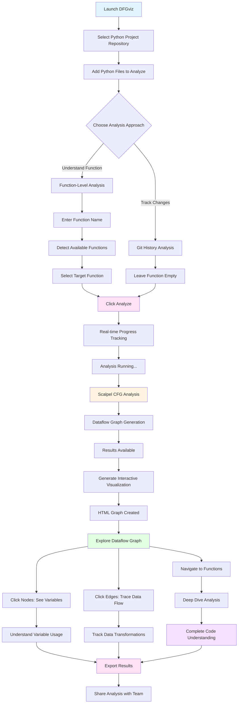

# DFGviz Workflow Guide - Python Code Analysis

## 📊 Optimized Analysis Workflow



## 🎯 How DFGviz Helps Analyze Python Code

### 1. **Variable-to-Variable Dataflow Tracking**
   - **Problem**: Hard to track how data flows between variables
   - **Solution**: Visual graph shows exact dataflow paths
   - **Benefit**: Understand variable dependencies and transformations

### 2. **Function Call Relationships**
   - **Problem**: Complex function call chains are hard to follow
   - **Solution**: Interactive graph shows function relationships
   - **Benefit**: Navigate between functions with one click

### 3. **Path-Sensitive Analysis**
   - **Problem**: Conditional logic creates multiple execution paths
   - **Solution**: Scalpel CFG tracks dataflow through all paths
   - **Benefit**: See how data flows in different scenarios

### 4. **Git History Evolution**
   - **Problem**: Hard to see how dataflow changed over time
   - **Solution**: Analyze each commit separately
   - **Benefit**: Track dataflow evolution and identify breaking changes

### 5. **Interprocedural Analysis**
   - **Problem**: Dataflow across function boundaries is complex
   - **Solution**: Analyzes entire call chain, not just single function
   - **Benefit**: Complete picture of dataflow across modules

## 🔍 Analysis Workflow Steps

### Step 1: Select Your Python Project
```
Browse → Select Git Repository → Files Auto-detected
```

### Step 2: Choose Analysis Mode

**Mode A: Function Analysis** (Recommended for focused understanding)
- Enter function name or browse available functions
- Analyzes only the selected function
- **Best for**: Understanding specific function behavior

**Mode B: Git History Analysis** (Recommended for change tracking)
- Leave function field empty
- Analyzes all commits
- **Best for**: Tracking dataflow changes over time

### Step 3: Run Analysis
```
Click Analyze → Watch Progress → View Colored Logs
```

**What happens during analysis:**
1. Scalpel CFG parses Python code
2. Builds control flow graph
3. Tracks variable assignments and uses
4. Identifies dataflow paths
5. Generates graph representation

### Step 4: Explore Results

**Interactive Graph Features:**
- **Node Size**: Indicates flow complexity
- **Edge Colors**: Different flow types
  - Normal flows
  - Path conditions
  - Bidirectional flows
- **Click Nodes**: See variable details
- **Click Edges**: Navigate to related functions
- **Zoom & Pan**: Explore large graphs

### Step 5: Deep Dive Analysis

**Navigate Function Pages:**
- Click any function name in the graph
- Opens dedicated function analysis page
- See complete dataflow for that function
- Trace data from input to output

### Step 6: Export & Share

**Export Options:**
- JSON format for programmatic access
- HTML files for visual sharing
- Standalone HTML (no server needed)

## 💡 Optimal Usage Patterns

### Pattern 1: Understanding New Codebase
```
1. Select repository
2. Auto-detect all Python files
3. Start with main entry function
4. Click through function calls in graph
5. Build mental model of dataflow
```

### Pattern 2: Debugging Data Issues
```
1. Select repository
2. Add file with problematic function
3. Enter function name
4. Analyze dataflow
5. Trace from source to sink
6. Identify where data gets corrupted
```

### Pattern 3: Code Review Preparation
```
1. Select repository
2. Add changed files
3. Run git history analysis
4. Compare graphs across commits
5. Identify dataflow changes
6. Document findings
```

### Pattern 4: Security Audit
```
1. Select repository
2. Add files with sensitive operations
3. Analyze functions handling sensitive data
4. Trace dataflow paths
5. Identify potential leaks
6. Export results for documentation
```

## 🚀 Quick Analysis Workflow (2 minutes)

```
Launch → Select Repo → Add Files → Enter Function → Analyze → Explore Graph
```

## 📈 Analysis Benefits

### For Developers
- ✅ **Faster Code Understanding**: Visual representation beats reading code
- ✅ **Better Debugging**: Trace dataflow to find issues quickly
- ✅ **Safer Refactoring**: See dependencies before changing code

### For Code Reviewers
- ✅ **Spot Dataflow Issues**: Identify problematic data transformations
- ✅ **Track Changes**: See how dataflow evolved across commits
- ✅ **Document Findings**: Export graphs for review documentation

### For Security Teams
- ✅ **Track Sensitive Data**: Follow dataflow from source to sink
- ✅ **Identify Risks**: Find potential data leaks
- ✅ **Audit Trails**: Export analysis results

### For Architects
- ✅ **Understand Dependencies**: See how modules interact
- ✅ **Plan Refactoring**: Identify coupling points
- ✅ **Document Architecture**: Visual graphs as documentation

## 🎨 Visualization Features

### Interactive Exploration
- **Zoom**: Scroll to zoom in/out
- **Pan**: Drag to move around graph
- **Click**: Interact with nodes and edges
- **Filter**: Show/hide flow types

### Graph Elements
- **Nodes**: Variables, functions, classes
- **Edges**: Dataflow paths, function calls
- **Colors**: Different flow types
- **Sizes**: Complexity indicators

## 🔗 Integration with Development Workflow

```
Code → Commit → Analyze → Review → Merge
         ↓
    DFGviz Analysis
         ↓
    Visual Insights
         ↓
    Better Decisions
```

---

**Start analyzing your Python code now!** Download DFGviz and follow the workflow above. 🚀
